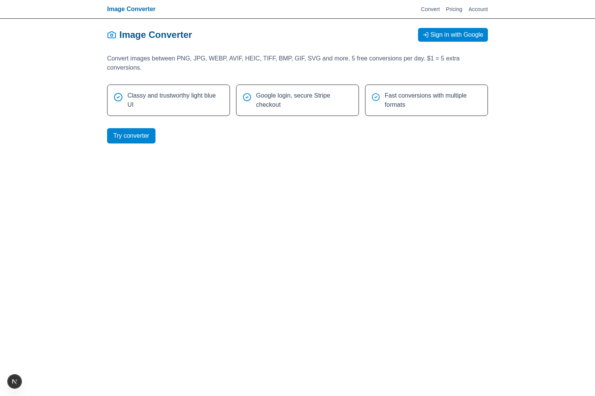

# 🖼️ Image Converter - Frontend



<!-- Dummy change for testing PR creation capability -->

## 🚀 Next.js Frontend for Image Converter

This is the frontend application for the Image Converter, built with Next.js 15, TypeScript, Tailwind CSS, and NextAuth for authentication. It provides a modern, responsive interface for converting images between various formats.

## 📋 Prerequisites

### 🖥️ Windows Users
- **Node.js 20+** 📦
  - Download from [Node.js Official Website](https://nodejs.org/)
  - Choose the LTS version
  - Verify installation: `node --version` and `npm --version`
- **Git** 🔧
  - Download from [Git for Windows](https://gitforwindows.org/)
  - Verify installation: `git --version`

### 🍎 macOS Users
- **Node.js 20+** 📦
  ```bash
  # Using Homebrew (recommended)
  brew install node@20
  
  # Or download from Node.js website
  ```
- **Git** 🔧
  ```bash
  # Usually pre-installed, or install with Homebrew
  brew install git
  ```

## 🔧 Environment Setup

### 1. 📁 Clone the Repository
```bash
git clone https://github.com/raimonvibe/change-my-image.git
cd change-my-image/frontend
```

### 2. 📦 Install Dependencies

#### 🖥️ Windows (Command Prompt/PowerShell)
```cmd
npm install
```

#### 🍎 macOS (Terminal)
```bash
npm install
```

### 3. 🔑 Environment Configuration

Create a `.env.local` file in the frontend directory:

#### 🖥️ Windows
```cmd
# Create the file
echo. > .env.local
```

#### 🍎 macOS
```bash
# Create the file
touch .env.local
```

Add the following content to `.env.local`:
```env
NEXT_PUBLIC_API_URL=http://localhost:8080
NEXTAUTH_URL=http://localhost:3000
NEXTAUTH_SECRET=generate-a-random-secret-key-here
GOOGLE_CLIENT_ID=your-google-oauth-client-id
GOOGLE_CLIENT_SECRET=your-google-oauth-client-secret
```

## 🏃‍♂️ Running the Application

### 🖥️ Windows
```cmd
# Navigate to frontend directory
cd frontend

# Start development server
npm run dev
```

### 🍎 macOS
```bash
# Navigate to frontend directory
cd frontend

# Start development server
npm run dev
```

## ✅ Verification

Once the application starts successfully, you should see:
```
▲ Next.js 15.4.6 (Turbopack)
- Local:        http://localhost:3000
- Network:      http://[your-ip]:3000

✓ Ready in [time]ms
```

### 🔍 Test the Frontend
- **Homepage**: http://localhost:3000
- **Convert Page**: http://localhost:3000/convert
- **Pricing Page**: http://localhost:3000/pricing

## 🏗️ Application Architecture

### 📦 Key Technologies
- **Next.js 15** - React framework with App Router
- **TypeScript** - Type-safe JavaScript
- **Tailwind CSS** - Utility-first CSS framework
- **NextAuth** - Authentication library
- **Zustand** - State management
- **React Dropzone** - File upload component
- **Axios** - HTTP client
- **Lucide React** - Icon library

### 📁 Project Structure
```
frontend/
├── src/
│   ├── app/                 # App Router pages
│   │   ├── api/            # API routes
│   │   ├── convert/        # Convert page
│   │   ├── pricing/        # Pricing page
│   │   └── layout.tsx      # Root layout
│   ├── components/         # Reusable components
│   ├── lib/               # Utility functions
│   └── types/             # TypeScript types
├── public/                # Static assets
├── .env.local            # Environment variables
└── package.json          # Dependencies
```

### 🎨 Key Features
- **🖼️ Image Upload**: Drag & drop or click to select files
- **🔄 Format Conversion**: Support for JPG, PNG, WEBP, AVIF, HEIC, TIFF, BMP, GIF, SVG
- **⚙️ Quality Control**: Adjustable compression quality
- **🔐 Authentication**: Google OAuth integration
- **💳 Billing**: Stripe integration for premium features
- **📱 Responsive Design**: Works on desktop, tablet, and mobile

## 🔐 Configuration

### 🌍 Environment Variables
| Variable | Description | Required |
|----------|-------------|----------|
| `NEXT_PUBLIC_API_URL` | Backend API URL | ✅ |
| `NEXTAUTH_URL` | Frontend URL for NextAuth | ✅ |
| `NEXTAUTH_SECRET` | Secret for NextAuth sessions | ✅ |
| `GOOGLE_CLIENT_ID` | Google OAuth client ID | ✅ |
| `GOOGLE_CLIENT_SECRET` | Google OAuth client secret | ✅ |

### 🔧 Google OAuth Setup
1. Go to [Google Cloud Console](https://console.cloud.google.com/)
2. Create a new project or select existing one
3. Enable Google+ API
4. Create OAuth 2.0 credentials
5. Add authorized redirect URI: `http://localhost:3000/api/auth/callback/google`
6. Copy Client ID and Client Secret to `.env.local`

## 🎯 Available Scripts

```bash
# Development server with Turbopack
npm run dev

# Build for production
npm run build

# Start production server
npm start

# Run ESLint
npm run lint
```

## 🐛 Troubleshooting

### Common Issues

#### ❌ "Module not found" errors
```bash
# Clear node_modules and reinstall
rm -rf node_modules package-lock.json
npm install
```

#### ❌ Port 3000 already in use
**🖥️ Windows:**
```cmd
# Find process using port 3000
netstat -ano | findstr :3000
# Kill the process (replace PID)
taskkill /PID [PID] /F

# Or use different port
npm run dev -- -p 3001
```

**🍎 macOS:**
```bash
# Find and kill process using port 3000
lsof -ti:3000 | xargs kill -9

# Or use different port
npm run dev -- -p 3001
```

#### ❌ NextAuth configuration errors
- Ensure `NEXTAUTH_URL` matches your frontend URL
- Generate a secure `NEXTAUTH_SECRET`: `openssl rand -base64 32`
- Verify Google OAuth credentials are correct

#### ❌ API connection issues
- Ensure backend is running on http://localhost:8080
- Check `NEXT_PUBLIC_API_URL` in `.env.local`
- Verify CORS settings in backend

#### ❌ Build errors with TypeScript
```bash
# Check for type errors
npm run lint

# Fix common issues
npm run build
```

## 🎨 Customization

### 🎨 Styling
- Modify `tailwind.config.js` for custom themes
- Update global styles in `src/app/globals.css`
- Component styles use Tailwind utility classes

### 🔧 Configuration
- Update `next.config.js` for Next.js settings
- Modify `tsconfig.json` for TypeScript configuration
- Adjust ESLint rules in `.eslintrc.json`

## 📱 Browser Support

- ✅ Chrome 90+
- ✅ Firefox 88+
- ✅ Safari 14+
- ✅ Edge 90+

## 📚 Additional Resources

- [Next.js Documentation](https://nextjs.org/docs)
- [TypeScript Documentation](https://www.typescriptlang.org/docs/)
- [Tailwind CSS Documentation](https://tailwindcss.com/docs)
- [NextAuth Documentation](https://next-auth.js.org/)
- [React Documentation](https://react.dev/)

## 🤝 Contributing

1. Fork the repository
2. Create a feature branch
3. Make your changes
4. Test thoroughly
5. Submit a pull request

## 🚀 Deployment

### Vercel (Recommended)
1. Connect your GitHub repository to Vercel
2. Set environment variables in Vercel dashboard
3. Deploy automatically on push to main branch

### Other Platforms
- **Netlify**: Configure build command as `npm run build`
- **AWS Amplify**: Use the Next.js build settings
- **Docker**: Use the included Dockerfile for containerization

---

# 🖼️ Image Converter - Backend


## 🚀 Spring Boot Backend for Image Converter

This is the backend service for the Image Converter application, built with Spring Boot. It provides REST APIs for image conversion, user authentication with Google OAuth, and billing integration with Stripe.

## 📋 Prerequisites

### 🖥️ Windows Users
- **Java 17+** 📦
  - Download from [Oracle JDK](https://www.oracle.com/java/technologies/downloads/) or [OpenJDK](https://adoptium.net/)
  - Verify installation: `java --version`
- **Maven** 🔧
  - Download from [Apache Maven](https://maven.apache.org/download.cgi)
  - Add to PATH environment variable
  - Verify installation: `mvn --version`
- **Docker Desktop** 🐳
  - Download from [Docker Desktop for Windows](https://www.docker.com/products/docker-desktop/)
  - Enable WSL 2 backend if prompted
- **ImageMagick** 🎨
  - Download from [ImageMagick Windows](https://imagemagick.org/script/download.php#windows)
  - Make sure to check "Install development headers and libraries for C and C++" during installation

### 🍎 macOS Users
- **Java 17+** 📦
  ```bash
  # Using Homebrew
  brew install openjdk@17
  
  # Or download from Oracle/OpenJDK websites
  ```
- **Maven** 🔧
  ```bash
  # Using Homebrew
  brew install maven
  ```
- **Docker Desktop** 🐳
  - Download from [Docker Desktop for Mac](https://www.docker.com/products/docker-desktop/)
- **ImageMagick** 🎨
  ```bash
  # Using Homebrew
  brew install imagemagick
  ```

## 🔧 Environment Setup

### 1. 📁 Clone the Repository
```bash
git clone https://github.com/raimonvibe/change-my-image.git
cd change-my-image/backend
```

### 2. 🗄️ Start PostgreSQL Database
```bash
# From the project root directory
cd ..
docker compose up -d
```

### 3. 🔑 Set Environment Variables

#### 🖥️ Windows (Command Prompt)
```cmd
set DATABASE_URL=jdbc:postgresql://localhost:5432/imageconverter
set DATABASE_USERNAME=postgres
set DATABASE_PASSWORD=postgres
set GOOGLE_CLIENT_ID=your-google-oauth-client-id
set STRIPE_SECRET_KEY=sk_test_xxx
set STRIPE_PUBLISHABLE_KEY=pk_test_xxx
set STRIPE_WEBHOOK_SECRET=whsec_xxx
set PORT=8080
```

#### 🖥️ Windows (PowerShell)
```powershell
$env:DATABASE_URL="jdbc:postgresql://localhost:5432/imageconverter"
$env:DATABASE_USERNAME="postgres"
$env:DATABASE_PASSWORD="postgres"
$env:GOOGLE_CLIENT_ID="your-google-oauth-client-id"
$env:STRIPE_SECRET_KEY="sk_test_xxx"
$env:STRIPE_PUBLISHABLE_KEY="pk_test_xxx"
$env:STRIPE_WEBHOOK_SECRET="whsec_xxx"
$env:PORT="8080"
```

#### 🍎 macOS/Linux (Terminal)
```bash
export DATABASE_URL=jdbc:postgresql://localhost:5432/imageconverter
export DATABASE_USERNAME=postgres
export DATABASE_PASSWORD=postgres
export GOOGLE_CLIENT_ID=your-google-oauth-client-id
export STRIPE_SECRET_KEY=sk_test_xxx
export STRIPE_PUBLISHABLE_KEY=pk_test_xxx
export STRIPE_WEBHOOK_SECRET=whsec_xxx
export PORT=8080
```

## 🏃‍♂️ Running the Application

### 🖥️ Windows
```cmd
# Navigate to backend directory
cd backend

# Run with Maven
mvn spring-boot:run
```

### 🍎 macOS
```bash
# Navigate to backend directory
cd backend

# Run with Maven
mvn spring-boot:run
```

## ✅ Verification

Once the application starts successfully, you should see:
```
Started ImageConverterApplication in X.XXX seconds
Tomcat started on port 8080 (http) with context path '/'
```

### 🔍 Test the Backend
- **Health Check**: http://localhost:8080/health (should return "ok")
- **API Base URL**: http://localhost:8080

## 🏗️ Application Architecture

### 📦 Key Components
- **Controllers**: REST API endpoints for image conversion, billing, and user management
- **Services**: Business logic for image processing and user operations
- **Security**: Google OAuth integration and JWT token validation
- **Database**: PostgreSQL with JPA/Hibernate for data persistence
- **Image Processing**: ImageMagick integration for format conversion

### 🔌 API Endpoints
- `GET /health` - Health check endpoint
- `POST /api/convert` - Image conversion endpoint
- `POST /api/stripe/checkout` - Create Stripe checkout session
- `POST /api/stripe/webhook` - Stripe webhook handler
- `GET /api/user/credits` - Get user credit balance

## 🔐 Configuration

### 🌍 Environment Variables
| Variable | Description | Required |
|----------|-------------|----------|
| `DATABASE_URL` | PostgreSQL connection URL | ✅ |
| `DATABASE_USERNAME` | Database username | ✅ |
| `DATABASE_PASSWORD` | Database password | ✅ |
| `GOOGLE_CLIENT_ID` | Google OAuth client ID | ✅ |
| `STRIPE_SECRET_KEY` | Stripe secret key | ✅ |
| `STRIPE_PUBLISHABLE_KEY` | Stripe publishable key | ✅ |
| `STRIPE_WEBHOOK_SECRET` | Stripe webhook secret | ⚠️ |
| `PORT` | Server port (default: 8080) | ❌ |

### 📝 Application Properties
The application uses `application.yml` for configuration with environment variable substitution.

## 🐛 Troubleshooting

### Common Issues

#### ❌ "Permission denied" for mvnw
**🖥️ Windows:**
```cmd
# Maven wrapper might not have execute permissions
# Use system Maven instead
mvn spring-boot:run
```

**🍎 macOS:**
```bash
# Fix permissions
chmod +x mvnw
./mvnw spring-boot:run
```

#### ❌ Database Connection Failed
- Ensure PostgreSQL is running: `docker ps`
- Check if port 5432 is available
- Verify environment variables are set correctly

#### ❌ ImageMagick Not Found
- **Windows**: Reinstall ImageMagick and ensure it's in PATH
- **macOS**: `brew reinstall imagemagick`

#### ❌ Maven Not Found
- **Windows**: Download and install Maven, add to PATH
- **macOS**: `brew install maven`

## 📚 Additional Resources

- [Spring Boot Documentation](https://spring.io/projects/spring-boot)
- [PostgreSQL Documentation](https://www.postgresql.org/docs/)
- [ImageMagick Documentation](https://imagemagick.org/)
- [Stripe API Documentation](https://stripe.com/docs/api)
- [Google OAuth Documentation](https://developers.google.com/identity/protocols/oauth2)

## 🤝 Contributing

1. Fork the repository
2. Create a feature branch
3. Make your changes
4. Test thoroughly
5. Submit a pull request

---

🎉 **Happy coding!** If you encounter any issues, please check the troubleshooting section or create an issue in the repository.
